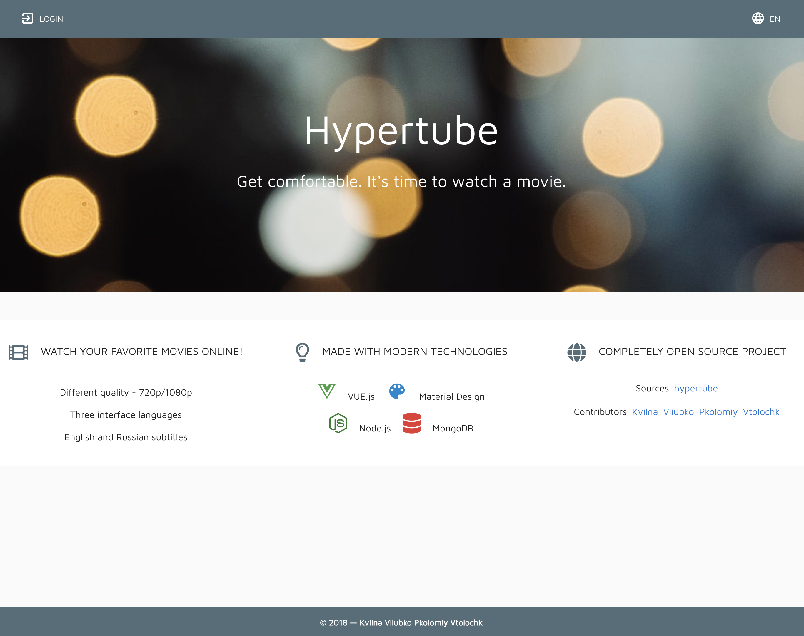
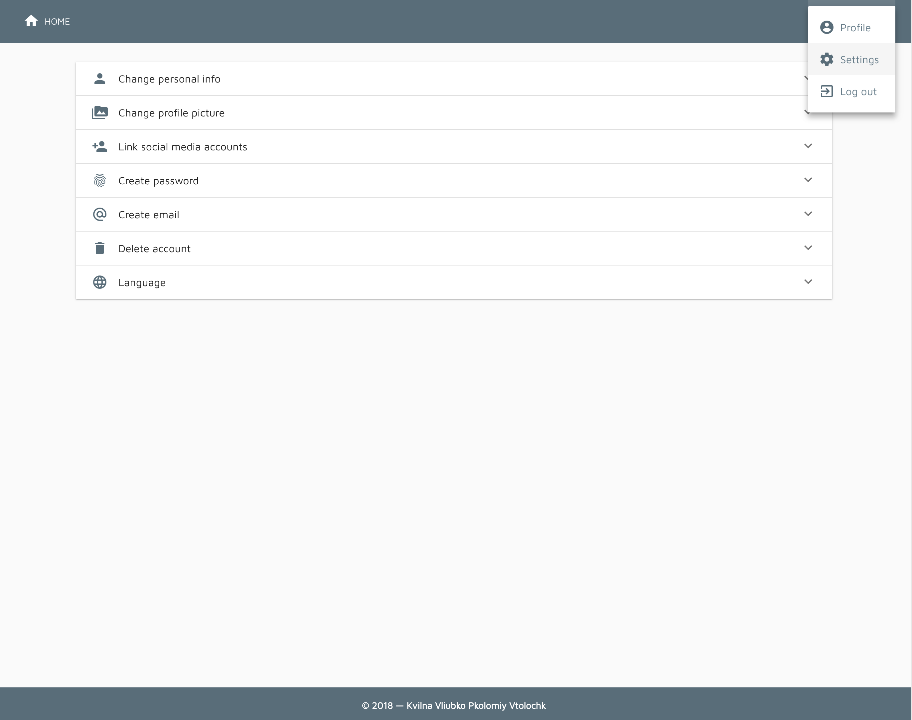

# 🎥  HYPERTUBE 🍿

Hypertube is a torrent downloading/streaming web app that allows users to research and watch videos with the best UX possible.

## Preview

## Getting Started

These instructions will get you a copy of the project up and running on your local machine for development and testing purposes.

### Prerequisites
git clone https://github.com/semkaway/hypertube.git

[Install docker](https://docs.docker.com/install/)

[Install node](https://nodejs.org/en/download/)

[Install mongoDB](https://docs.mongodb.com/manual/installation/)

### How to run the project?

1. Run docker on your machine

2. `npm install` in /backend

3. `npm run db` in /backend

4. `npm start` in /backend

5. `npm install && npm start` in /frontend

6. Open browser and go to `http://localhost:8084`

7. Enjoy!

#### Defaults
    API: http://localhost:3000

    FRONTEND:http://localhost:8084

    MAILHOG: http://localhost:8025

## Built With

## Authors
[Kvilna](https://github.com/semkaway)

[Vliubko](https://github.com/vliubko)

[Pkolomiy](https://github.com/pkolomiy)

[Vtolochk](https://github.com/vtolochk)

## Acknowledgments
Made with love with my coworkers.

### Warning
This application is the result of a school project. It's purpose was to teach us about live file streaming and convertion using the bit torrent protocol. It was never meant to run in production and will never be.